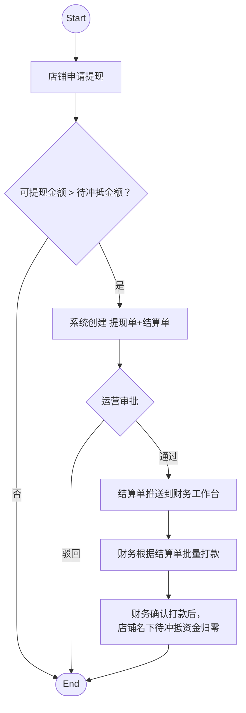

# 号商账户模型 & 售后模型 & 对账模型

> 由 Word 文档自动转换。图片见 `号商账户模型-assets/` 目录。

## 号商账户构成

号商账户由以下部分组成：

| 资金类型 | 定义 | 触发条件 | 方向 |
| --- | --- | --- | --- |
| 待入账 | 商品已售出、交易进行中未完成的收入 | 买家支付成功 / 交易完成前 | 正向 |
| 可提现 | 交易完成后的、号商可申请提现的收入 | 订单交易完成 | 正向 |
| 提现中 | 已提交提现申请，待运营审核或待打款的金额 | 号商提交提现申请 | 正向 |
| 已结算 | 已完成打款的累计金额 | 财务登记打款完成 | 正向 |
| 待售后 | 售后退款中号商需承担且尚未支付给平台的金额 | 售后处理评估号商有责且号商未转款给平台 | 负向 |

ℹ️ **「待售后」为独立欠款池**，它记录的是号商对平台的债务，而非号商在平台的资产。

## 号商结算（提现）流程

### 3.1 定义

提现指号商将当前账户中的**全部可提现金额**提交给平台进行审核和打款的业务动作：

- 号商发起一次提现申请
- 本次提现金额固定为发起当时的全部可提现金额
- 提现提交后，该部分金额从「可提现」转入「提现中」
- 平台审批通过后进入打款流程，打款并登记完成后转入「已结算」

### 3.2 流程说明

#### 关键规则

| 规则 | 说明 |
| --- | --- |
| 全额提现 | 每次提现必须提走当前全部可提现金额 |
| 1:1 对应 | 一笔提现申请对应一张结算单 |
| 先打款后登记 | 系统"已结算"以打款登记完成为准 |
| 售后不自动抵扣 | 未完结售后单仅作为审批参考，不自动冲减提现金额 |
| 单笔进行中 | 同一号商同一时间仅允许一笔进行中的提现申请 |

### 3.3 提现单

提现单（即提现申请）是号商发起提现时生成的主申请单，用于记录本次提现的申请行为、申请金额、审批状态、打款进度及最终完成情况。

**提现单字段：**

| 字段 | 说明 | 备注 |
| --- | --- | --- |
| 提现单号 | 平台唯一编号 | |
| 主体 ID | 申请主体 ID | |
| 主体名称 | 申请主体名称 | |
| 主体类型 | 号商 / 个人卖家 / 用户 | 新增字段 |
| 申请时间 | 发起时间 | |
| 申请金额 | 发起时全部可提现金额 | |
| 状态 | 待审核 / 待打款 / 已驳回 / 已完结 | |
| 关联结算单号 | 与之 1:1 关联 | 新增字段 |
| 关联未完结售后单信息 | 审批参考信息，展示数量 + 售后单链接 | |
| 审批人 / 审批时间 | 审批记录 | |
| 驳回原因 | 驳回时必填 | |
| 打款登记时间 | 完结依据 | |
| 打款凭证 | 上传打款凭证 | |
| 备注 | 保留字段 | |

PS：具体数据表单设计由开发评估

**提现单状态：**

| 状态 | 含义 |
| --- | --- |
| 待审核 | 号商已提交提现申请，等待平台审批 |
| 待打款 | 提现申请已审批通过，等待财务打款 |
| 已驳回 | 提现申请未通过，流程终止，金额退回可提现 |
| 已完结 | 财务已打款并完成登记 |

### 3.4 结算单

### 3.5 结算单与提现单的关系

| 维度 | 提现单 | 结算单 |
| --- | --- | --- |
| 面向对象 | 号商侧 | 平台侧 |
| 语义 | 承载「我要提现」的动作语义 | 承载「结多少钱、结哪些单」的凭证语义 |
| 作用 | 作为平台审批与放款的主入口 | 作为财务打款与对账的依据 |
| 关联 | 串联结算单和未完结售后单 | 汇总订单应得明细与应结总金额 |

**二者关系：**

- 提现申请与结算单为 **1:1** 关系
- 号商每发起一次提现，系统自动生成一张结算单
- 平台审批的是提现申请
- 提现申请状态随审批结果同步变化
- 财务完成打款登记后，结算单 → 已结算，提现申请 → 已完结

# 售后模型

## 售后单状态定义及状态流转

### 状态定义

售后单共 5 个状态：待处理 / 处理中 / 追款中 / 已拒绝 / 已完结

| 状态 | 含义 | 进入条件 | 退出条件 |
| --- | --- | --- | --- |
| 待处理 | 售后单已创建，等待客服受理 | 用户点击「申请售后」自动创建；或客服手动创建 | 客服受理 → 处理中 |
| 处理中 | 客服正在处理售后问题 | 客服手动受理售后单 | 需追款 → 追款中；处理完成 → 已完结；判定不合理 → 已拒绝 |
| 追款中 | 平台已垫付退款给用户，向号商追款中 | 售后涉及号商承担且号商未转款，平台先垫付 | 追回全部款项 → 已完结 |
| 已拒绝 | 售后申请被拒绝 | 客服判定无需处理或申请不合理 | 终态 |
| 已完结 | 售后处理完毕，资金闭环 | 售后完结，退款完成（如有）+ 追款完成（如有） | 终态 |

PS：此处的状态流转，需要与冷晗沟通：「待处理」是否必须到「处理中」？只有「处理中」才能到「已拒绝」？

### 状态流转

## 售后单字段设计

### 字段列表

| 字段名 | 字段说明 | 备注 |
| --- | --- | --- |
| 退款金额 | 应退款总额 | 客服手动输入 |
| 平台应付 | 平台应承担金额 | 客服判手动输入，用于事后盈亏统计，平台应付即平台赔付给用户的钱。 |
| 号商应付 | 号商应承担金额 | 客服判责后手动输入，如果出现需要向号商追款的情况，该金额即「待追款金额」，计入号商账户的「待售后」资金部分 |

PS：

1. 以上为当前方案下售后单需要的字段，研发根据实际情况进行新增。
2. 需向冷晗确认：号商应付部分，是否会出现号商分批付款的情况？如果不会，该字段可以作为「待追款金额」共用
3. 售后单状态如果流转为追款中，「号商应付」应 >0

## 售后流程图

# 对账模型

## 资金流水单定义与字段

### 定义

当前平台可能产生收支的全部情况及对应的流水单类型（业务类型/收支方向）：

- **收入**
	- 用户下单购买商品时的付款金额 \- 买家付款 / 收入
	- 产生售后时号商赔付给平台的金额 \- 售后处理 / 收入
		- 号商先转款给平台，平台再赔付给用户
		- 平台先垫付给用户，再向号商追讨回
- **支出**
	- 号商提现时，给号商结算的金额 \- 卖家结算 / 支出
	- 产生售后时平台赔付给用户的金额 \- 售后处理 / 支出
		- 平台应承担的赔款
		- 帮号商垫付的赔款

### 字段设计

| 字段名 | 字段说明 | 备注 |
| --- | --- | --- |
| 流水单号 | 全局唯一，可做对账主键 | |
| 流水产生时间 | 流水单创建时间 | 系统自动填写 |
| 业务类型 | 买家付款 / 卖家结算 / 售后处理 / ... | 做成标签供选择 |
| 关联业务单号 | 销售订单号 / 结算单号 / 售后单号 / ... | |
| 收支方向 | 收入 / 支出 | |
| 金额 | 收支金额 | |
| 付款方 | - | |
| 收款方 | - | |
| 支付渠道 | 微信 / 支付宝 / 银行转帐 | 做成标签供选择 |
| 收付款凭证 | 可上传多张图片 | |
| 备注 | 如：号商售后追回 | |

PS：以上只是产品规划的字段信息，需研发根据具体实现进行设计

## 资金流水单生成时机

### 售后场景：

售后处理页面保留「登记收支」按钮：

- 客服在收到号商转账后手动登记
- 客服在向用户退款转正后手动登记

### 结算场景：

财务在根据「结算单」给号商结算后，登记打款时

## 对账逻辑

财务按需在平台导出指定时间范围的「收支流水单」手动对账

