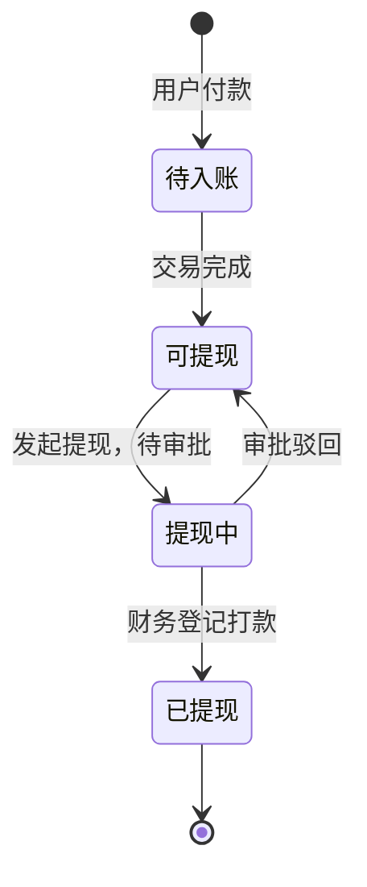
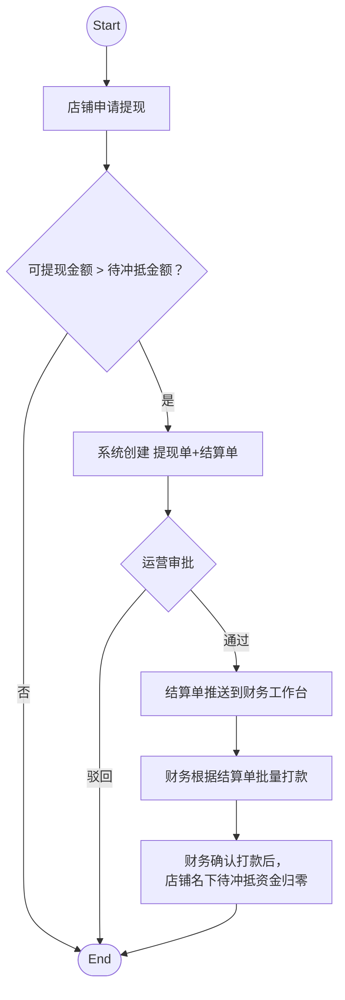
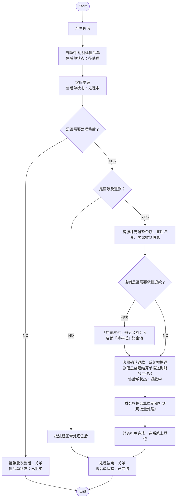

# 店铺结算 & 财务结算 & 财务对账 & 售后流程

> 本文档基于「号商账户模型&售后模型&对账模型」整合最新财务对齐需求后优化，将「号商」全面替换为「店铺」。
>
> 最新需求来源：`结算&对账规划.md`

---

## 一、店铺账户资金构成

### 1.1 资金类型

店铺账户由正向资金和负向资金两部分构成：

| 资金类型 | 定义 | 触发条件 | 方向 |
| --- | --- | --- | --- |
| 待入账 | 商品已售出、交易进行中未完成的收入 | 买家支付成功 / 交易完成前 | 正向 |
| 可提现 | 交易完成后的、店铺可申请提现的收入 | 订单交易完成 | 正向 |
| 提现中 | 已提交提现申请，待运营审核或待打款的金额 | 店铺提交提现申请 | 正向 |
| 已提现 | 已完成打款的累计金额 | 财务登记打款完成 | 正向 |
| 待冲抵 | 店铺商品产生售后，需在下一次提现时冲抵的金额 | 财务打款后，售后涉及店铺承担责任的部分 | 负向 |

**关键说明：**

- 正向资金用于记录店铺下商品销售后的收入
- 负向资金（「待冲抵」）用于记录店铺商品产生售后需承担的赔付金额，下次提现时自动抵扣

- 「待冲抵」为独立欠款池，记录的是店铺对平台的债务，而非店铺在平台的资产

---

## 二、店铺提现流程

### 2.1 定义

提现指店铺将当前账户中的**全部可提现金额**提交给平台进行审核和打款的业务动作：

- 店铺发起一次提现申请
- 本次提现金额固定为发起当时的全部可提现金额
- 如果「可提现」 <= 「待冲抵」，则不允许发起提现
- 提现提交后，该部分金额从「可提现」转入「提现中」
- 平台审批通过后进入打款流程，打款并登记完成后转入「已提现」

### 2.2 流程说明

### 2.3 关键规则

| 规则 | 说明 |
| --- | --- |
| 全额提现 | 每次提现必须提走当前全部可提现金额 |
| 1:1 对应 | 一笔提现申请对应一张结算单 |
| 先打款后登记 | 系统"已提现"以打款登记完成为准 |
| 单笔进行中 | 同一店铺同一时间仅允许一笔进行中的提现申请 |
| 自动冲抵 | 提现时，「可提现」需先抵扣「待冲抵」；财务打款后，店铺「待冲抵」金额归零|

### 2.4 提现单

提现单是店铺发起提现时生成的主申请单，用于记录本次提现的申请行为、申请金额、审批状态、打款进度及最终完成情况。

**提现单字段：**

| 字段 | 说明 | 备注 |
| --- | --- | --- |
| 提现单号 | 平台唯一编号 | |
| 主体类型 | 店铺 / 个人 |当前只会有店铺，保留后续个人类型的拓展空间 |
| 主体ID | 申请主体ID | |
| 主体名称 | 申请主体名称 | |
| 申请时间 | 发起时间 | |
| 申请金额 | 发起时全部可提现金额 | |
| 状态 | 待审核 / 待打款 / 已驳回 / 已完结 | |
| 关联结算单号 | 与之 1:1 关联 | |
| 关联待冲抵 | 当前待冲抵金额 + 关联的售后单数量 + 售后单链接 | 审批参考信息 |
| 审批人 / 审批时间 | 审批记录 | |
| 驳回原因 | 驳回时必填 | |
| 备注 | 保留字段 | |

**提现单状态：**

| 状态 | 含义 |
| --- | --- |
| 待审核 | 店铺已提交提现申请，等待平台审批 |
| 待打款 | 提现申请已审批通过，等待财务打款 |
| 已驳回 | 提现申请未通过，流程终止，金额退回可提现 |
| 已完结 | 财务已打款并完成登记 |

### 2.5 结算单

结算单是承载「结多少钱、结哪些单」凭证语义的单据，是财务打款与对账的依据。

**结算单类型：**

| 类型 | 触发场景 | 结算方 |
| --- | --- | --- |
| 提现结算 | 店铺申请提现审批通过后 / 用户申请提现（未来） | 店铺 / 用户 |
| 售后退款 | 买家退款 / 店铺承担赔付 | 用户 / 店铺 |

**结算单字段：**

#### 基本信息

| 字段 | 说明 | 备注 |
| --- | --- | --- |
| 结算单号 | 平台唯一编号 | |
| 结算类型 | 提现结算 / 售后退款 | 根据场景区分 |
| 关联业务单号 | 关联业务单据 | 提现结算时关联提现单号；售后退款时关联售后单号 |
| 状态 | 待打款 / 已打款 | |
| 结算方类型 | 店铺 / 个人 | 用于区分结算对象 |
| 结算方 ID | 结算对象 ID | |
| 结算方名称 | 结算对象名称 | |
| 结算金额 | 本次应结金额 |必填 |
| 收款方名称 | 收款方银行账户或支付宝账户实名认证的名称 | 必填 |
| 收款方账号 | 银行卡号 或 支付宝账号/邮箱/手机号 | 必填 |
| 收款方开户行名称 | 开户行名称 | 非必填，个人收款时可填「支付宝」 |
| 收款行联行号 |   |非必填 |
| 附言/用途 |  | 必填，最多40字，如"货款"、"提现款" |

> **说明：** 提现结算场景下，收款信息从店铺/用户维护的收款账户中自动获取；售后退款场景下，由售后客服手动补充收款信息（因当前系统暂无用户资金账户）。

#### 关联订单明细（店铺结算时用）

| 字段 | 说明 | 备注 |
| --- | --- | --- |
| 订单号 | 本次结算涉及的订单编号 | |
| 商品名称 | 订单商品名 | |
| 店铺名称 | 店铺名 | |
| ......    | ...... | |
| 订单金额 | 订单用户实付金额 | |
| 应结金额 | 该订单店铺的收入 | |
| 平台服务费 | 平台抽佣 | |
| 支付服务费 | 支付渠道费用 |支付宝万六，微信？ |
| 履约包赔 | 包赔金额 | |

#### 关联售后明细（店铺结算时用）

| 字段 | 说明 | 备注 |
| --- | --- | --- |
| 售后单号 | 本次结算涉及的售后单编号 | |
| 商品名称 | 订单商品名 | |
| 店铺名称 | 店铺名 | |
| ......    | ...... | |
| 售后金额 | 应退款金额 | |
| 平台应付 | 平台应承担的金额 | |
| 店铺应付 | 店铺应承担的金额 | |
| 支付服务费 | 支付渠道费用 |由平台承担？ |

#### 打款信息

| 字段 | 说明 | 备注 |
| --- | --- | --- |
| 打款登记时间 | 财务打款完成时间 | |
| 打款备注 | | 批量标记已打款时，备注可自动填写为：批量标记打款；打款失败的时财务手动备注具体情况 |

**结算单状态：**

| 状态 | 含义 |
| --- | --- |
| 待打款 | 推送至财务工作台，等待打款 |
| 已打款 | 财务已打款并完成登记 |

> **状态说明：** 审批驳回时，结算单直接作废

### 2.6 提现单与结算单的关系

| 维度 | 提现单 | 结算单 |
| --- | --- | --- |
| 面向对象 | 店铺侧 | 平台侧（财务） |
| 语义 | 承载「我要提现」的动作语义 | 承载「结多少钱、结哪些单」的凭证语义 |
| 作用 | 作为平台审批与放款的主入口 | 作为财务打款与对账的依据 |

**二者关系：**

- 提现申请与结算单为 **1:1** 关系
- 店铺每发起一次提现，系统自动生成一张结算单
- 平台审批的是提现申请
- 审批驳回时，结算单直接作废；财务完成打款登记后，结算单 → 已打款，提现申请 → 已完结

### 2.7 批量结算

- 财务可在工作台批量选中多条结算单，导出「批量转账模板」，完成打款后可批量标记「已打款」（标记时除了状态还要填写备注）
- 每条结算单可单独导出

---

## 三、售后流程

### 3.1 售后单状态定义

售后单共 5 个状态：待处理 / 处理中 / 退款中 / 已完结 / 已拒绝

| 状态 | 含义 | 进入条件 | 退出条件 |
| --- | --- | --- | --- |
| 待处理 | 售后单已创建，等待客服受理 | 用户点击「申请售后」自动创建；或客服手动创建 | 客服受理 → 处理中 |
| 处理中 | 客服正在处理售后问题，填写责任方/金额等信息 | 客服手动受理售后单 | 信息填写完毕 → 退款中；判定不合理 → 已拒绝 |
| 退款中 | 客服已确认退款，等待财务打款 | 客服点击「确认退款」 |财务打款后自动 → 已完结 |
| 已拒绝 | 售后申请被拒绝 | 客服判定无需处理或申请不合理 | 终态 |
| 已完结 | 退款已完成 | 财务在结算面板确认打款后，系统自动流转 | 终态 |

### 3.2 售后流程图

### 3.3 售后单字段设计
**基本字段**

| 字段名 | 字段说明 | 必填 | 备注 |
| --- | --- | --- | --- |
| 售后单号 | 平台唯一编号 | ✔️ | 系统自动带入，只读 |
| 售后状态 | 待处理 / 处理中 / 已拒绝 / 退款中 / 已完结 | ✔️ | 系统自动带入+客服手动流转 |
| 订单号 | 关联订单 | ✔️ | 系统自动带入，只读 |
| 用户信息 | 用户 ID / 昵称 | ✔️ | 系统自动带入，只读 |
| 店铺信息 | 店铺 ID / 名称 | ✔️| 系统自动带入，只读 |
| 商品信息 | 商品名称 / 价格 | ✔️ | 系统自动带入，只读 |
| 订单实付金额 | 用户实际支付的金额 | ✔️ | 系统自动带入，只读 |
| 订单支付时间 | 订单完成支付的时间 | ✔️| 系统自动带入，只读 |
| ...... | ...... | ......| ...... |
PS：基本字段以现有系统库表为准，开发根据需求和实际情况酌情添加
---

**用户申请售后时需填**
| 字段名 | 字段说明 | 必填 | 备注 |
| --- | --- | --- | --- |
| 售后原因 | 用户填写的售后原因 | ✔️ | 用户申请时填写 |
| 售后凭证 | 用户上传的图片 / 证据 | ✔️ | 用户申请时填写 |

---
**客服处理时需填**
| 字段名 | 字段说明 | 必填 | 备注 |
| --- | --- | --- | --- |
| 售后类型 | 账号人脸 / 账号找回 / 账号冻结 / 未成年退款 / 其他 | ✔️ | 客服填写 |
| 责任方 | 店铺有责 / 店铺无责 | 条件必填	 | 客服填写（如涉及退款） |
| 退款金额 | 本次退款总金额 | 条件必填	 | 客服填写（如涉及退款） |
| 平台应付 | 平台承担的退款金额 | 条件必填	 | 客服填写（如涉及退款）；用于财务统计 |
| 店铺应付 | 店铺承担的退款金额 | 条件必填 | 客服填写（如涉及退款）；责任方=店铺有责时必填，计入店铺「待冲抵」 |
| 收款方名称 | 退款收款方姓名 | 条件必填	 | 客服填写（如涉及退款） |
| 收款方账号 | 退款收款方银行账号 | 条件必填	 | 客服填写（如涉及退款） |
| 收款方开户行名称 | 退款收款方开户行 | 条件必填 | 客服填写（如涉及退款），开户行名称 / 支付宝 |
| 附言/用途 | 银行转账附言，限40字 | 条件必填 | 客服填写（如涉及退款） |
| 处理备注 | 客服内部处理记录 | 选填 | 客服填写 |
| 补充资料 | 图片资料上传（支持多张） | 选填 | 客服填写 |

### 3.4 售后资金处理规则

| 场景 | 处理方式 |
| --- | --- |
| **店铺有责 + 平台垫付** | 平台垫付退款给用户 → 创建结算单推至财务 → 财务打款后店铺「待冲抵」+金额 |
| **店铺无责** | 平台全额承担退款 → 创建结算单推至财务 → 财务打款给用户 |
| **下次提现时** | 店铺申请提现时，「可提现」需先抵扣「待冲抵」金额，剩余部分方可提现 |

### 3.5 结算单与售后单的关联

- 客服点击「确认退款」后，系统自动创建结算单（类型：售后退款），并关联当前售后单号
- 结算单推送至财务工作台
- 财务在结算面板确认打款后，结算单状态变为「已打款」
- **系统自动将关联的售后单从「退款中」流转到「已完结」**

---

## 四、财务结算

财务结算包含三个场景：

### 4.1 给店铺结算（提现）

-财务在财务工作台查看「结算单」
- 批量选中待打款的结算单，导出批量打款模板
- 完成银行转账后，在工作台批量确认打款
- 确认后，结算单状态变为「已打款」，店铺「待冲抵」归零

### 4.2 处理售后退款

- 客服确认退款后，系统创建「结算单」（类型：售后退款），推送到财务工作台
- 财务根据结算单打款给用户
- 打款完成后，该部分金额计入店铺「待冲抵」

### 4.3 内部结算（平台 & 包赔）

按月进行，由财务根据「财务月报」完成结算：

| 结算对象 | 结算方式 | 说明 |
| --- | --- | --- |
| 平台 | 扣除支付服务费后，按月结算 | 平台服务费收入 |
| 包赔 | 按月结算 | 包赔服务费收入 |

---

## 五、财务对账

### 5.1 月度财务报表

财务按月生成月度财务报表，以平台实际销售流水为数据源，**与结算单无关**。

**数据颗粒度：** 以订单为最细颗粒度

**每条记录需包含：**

| 字段 | 说明 |
| --- | --- |
| 订单号 | 平台唯一编号 |
| 店铺名称 | |
| 用户实付 | 买家实际支付金额 |
| 店铺应结算 | 扣除平台服务费后店铺应得 |
| 平台服务费 | 平台抽成 |
| 支付服务费 | 支付通道费 |
| 履约包赔 | 包赔服务费 |
| ...... | ...... |

**用途：**

- 财务按照月报完成报税
- 财务按照月报完成平台结算
- 财务按照月报完成包赔结算

### 5.2 对账方式

财务按需在平台导出指定时间范围的「财务报表」手动对账。

---

## 六、文档变更记录

| 版本 | 日期 | 变更说明 |
| --- | --- | --- |
| V1 | 2026-06-09 | 初始版本，整合最新财务对齐需求，将「号商」替换为「店铺」 |
| V1.1 | 2026-06-09 | 补充结算单设计，新增收款信息、关联订单明细、结算类型字段 |
| V1.2 | 2026-06-09 | 结算单调整：类型改为提现结算/售后退款；统一关联业务单号；移除已取消状态；店铺信息改为结算方信息，兼容店铺/用户 |
| V1.3 | 2026-06-09 | 售后流程大改：新增售后类型字段；状态调整为待处理/处理中/退款中/已完结/已拒绝；财务打款后自动流转售后单状态；客服填写字段完整设计 |